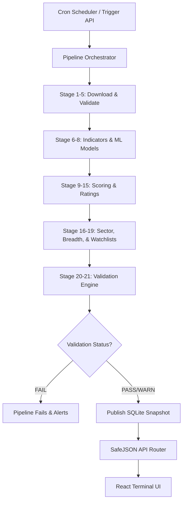

# PMS Engine Phase 13 — Architecture & Publishing Pipeline

The PMS Engine has evolved from an on-demand analysis application into an institutional-grade **Daily Research Publishing Platform**.

Instead of recalculating indicators and running ML models whenever a user loads the page, the system schedules or manual-triggers a single, consolidated **Daily Quantitative Research Snapshot** after the close of the trading session. Every component of the system consumes this official published snapshot by default.

---

## 1. System Architecture

---

## 2. Relational Snapshot Schema

The platform implements 10 normalized tables anchored by `snapshot_id` to store the output of each daily session:

1. **`snapshots`**: Master session metadata (start/end times, durations, versions, final status, validation quality score).
2. **`snapshot_stock`**: Per-security pricing (OHLCV) and derived scores (technical, ML, GRU, momentum, trend, composite).
3. **`snapshot_indicator`**: Derivation columns (above_ema20, near_52w_high, RSI, VWAP).
4. **`snapshot_score`**: Sub-score breakdowns (momentum, trend, volatility, ML signal probabilities) and explainable AI attribution drivers.
5. **`snapshot_sector`**: Sector aggregates (rankings, bullish/bearish ratio, top leader, average sector price changes).
6. **`snapshot_market`**: Universe-wide breadth indicators (regime, advance-decline ratio, average metrics).
7. **`snapshot_watchlist`**: Auto-generated lists (16 distinct categories with custom scoring parameters).
8. **`snapshot_change`**: recommendation upgrades/downgrades compared against the previous trading session.
9. **`snapshot_report`**: Links to generated PDF/HTML analytical summaries.
10. **`snapshot_validation`**: 12 pre-publish check outcomes (pass, fail, warning).
11. **`snapshot_metadata`**: Timing metrics for all 23 pipeline stages.

---

## 3. Pipeline Stages

The snapshot orchestrator execution flow runs in a background worker sequentially:

- **Stage 01–05: Ingestion**: Loads the universe, downloads market OHLCV quotes with fault-tolerant fallbacks, and executes fundamental mapping.
- **Stage 06–08: Quantitative ML**: Derives technical indicators and executes LightGBM, Random Forest, XGBoost, and GRU prediction nodes.
- **Stage 09–15: Rating Synthesis**: Computes composite and confidence scores, writes AI explanations, and assigns ratings.
- **Stage 16–19: Aggregations**: Generates sector models, market breadth indexes, and populates 16 watchlists.
- **Stage 20–23: Validation & Publish**: Runs the 12 validation rules, computes the overall health score, and flags the session as official.

---

## 4. Pre-Publish Validation Rules

The platform enforces 12 rules to verify data health before publishing:

1. **Min Coverage**: At least 80% of security downloads must succeed.
2. **No Duplicates**: Duplicate records are banned.
3. **Valid Score Range**: Scores must lie within [−100, 100].
4. **Valid Confidence**: Confidence must lie within [0, 100].
5. **Valid Rating Mappings**: Ratings must map to known grades.
6. **OHLCV Completeness**: Missing quotes must be under 30%.
7. **Indicators Completeness**: Indicator metrics must be populated.
8. **Data Freshness**: Quotes must be under 24 hours old.
9. **No Null Composites**: Composite score columns cannot contain nulls.
10. **Sector Coverage**: Over 50% of stocks must have mapped sectors.
11. **Portfolio Feasibility**: The candidate pool must contain at least 1 BUY+ stock.
12. **Recommendation Diffs**: Session-over-session deltas must compute successfully.
