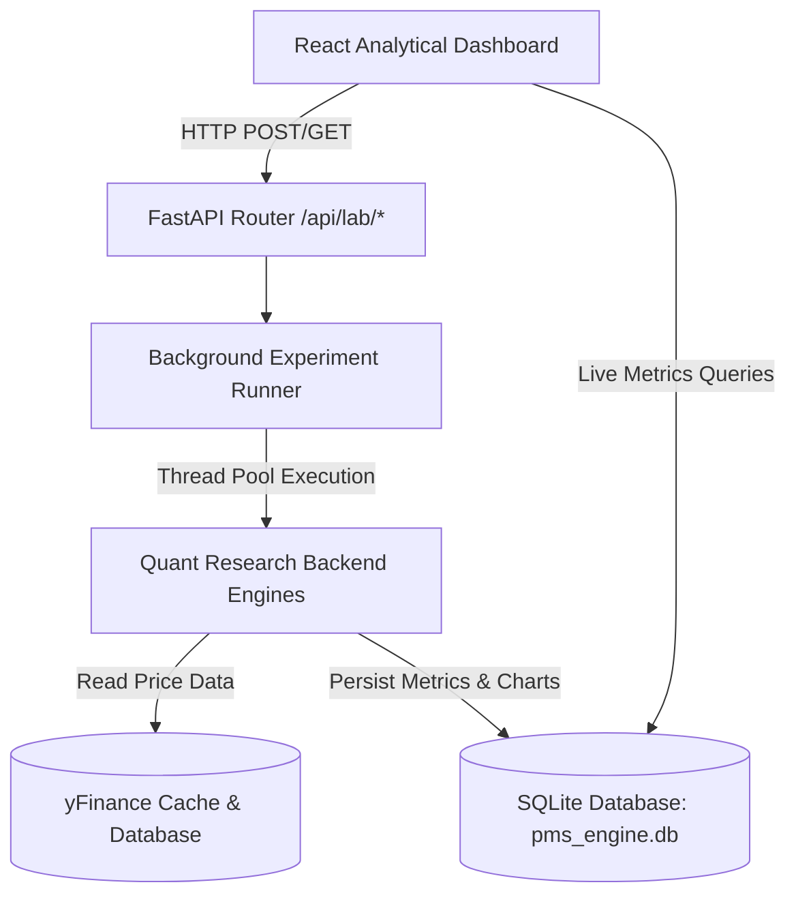

# PMS Engine v2 — Quantitative Research & Backtesting Laboratory Documentation

This document provides a comprehensive overview of the **PMS Engine v2**, focusing on the newly integrated **Institutional-Grade Backtesting & Quant Research Laboratory**. The objective of the platform is to ensure every indicator, scoring model, risk cutoff, and portfolio allocation weight is scientifically backtested and validated before being promoted into active recommendation engines.

---

## 1. System Architecture

The PMS Engine v2 is built on a modular, non-blocking asynchronous architecture using **FastAPI** for the backend engine and **React + Vite** for the frontend analytical dashboard. 



### Key Architectural Guidelines
- **No Heavy Frontend Calculations**: All statistics, mathematical optimizations (efficient frontiers, simulation paths), and data manipulations are processed inside the Python backend using vectorized libraries (**Pandas**, **NumPy**, **SciPy**).
- **Asynchronous Execution**: Long-running backtests and grid optimizations are processed in a background thread pool via FastAPI's `BackgroundTasks`, logging state progress into SQLite tables so the UI remains highly responsive.
- **Single-File SQLite Database**: No Celery, Redis, or PostgreSQL dependencies are introduced, maintaining simple database integrity (`pms_engine.db`) in the `backend/data/` folder.

---

## 2. Database Schema Configuration

The database holds all score histories, core signals, and research configurations. Below is the layout of the baseline and laboratory-specific tables:

### Baseline Data Tables
1. **`my_stocks`**: Active watchlist tickers.
2. **`security_master`**: Metadata, market caps, sectors, and liquidity metrics.
3. **`analysis_history`**: Baseline composite score logs used for drift audits.
4. **`report_history`**: Compiled research reports history.

### Laboratory Tables (Phase 12)
1. **`lab_experiments`**: Main registry logs of all backtest configurations (parameter settings, symbol, status: `pending`/`running`/`complete`/`failed`, engine versions, pipeline promotion stage, and controls like `is_paused`).
2. **`lab_metrics`**: Key performance indicators (KPIs) associated with completed experiments (CAGR, Sharpe, Max Drawdown, Calmar, Win Rate).
3. **`lab_charts`**: Serialized JSON series data (equity curves, histograms, scatter plots) rendered dynamically by Recharts.
4. **`lab_rec_audit`**: Target forward returns (1D to 365D horizons) associated with completed Buy/Sell ratings for hit rate calibrations.
5. **`lab_reports`**: Persistent links and compiled HTML/PDF files representing exportable quantitative reports.
6. **`lab_weight_snapshots`**: Sub-score optimization runs tracking optimal parameter paths.
7. **`lab_drift_alerts`**: Event log containing standard-deviation threshold violations detected by the drift monitor.

---

## 3. Quant Research Engines (`backend/app/lab/`)

The core mathematical modeling and backtesting features reside under `backend/app/lab/`. Here are the 11 engines:

### 1. Cross-Indicator Research (`cross_indicator.py`)
- **Objective**: Evaluates multi-indicator combinations to prevent overfitting single signals.
- **Logic**: Simulates logical joint intersections (e.g., `RSI < 30` **AND** `MACD Hist > 0` **AND** `ADX > 25`).
- **Output**: Returns ranked metrics comparing single, dual, and triple indicator combinations.

### 2. Ensemble Strategy Laboratory (`ensemble_researcher.py`)
- **Objective**: Compares ensemble voting methods to aggregate indicators/models.
- **Voting Methods**:
  - **Majority Voting**: Signals execute if > 50% of sub-models agree.
  - **Weighted Voting**: Weights assigned based on historical Sharpe ratios.
  - **Rank Aggregation**: Consensus calculated using Borda count ranks.

### 3. Parameter Grid Search Optimizer (`hyperopt_lab.py`)
- **Objective**: Searches parameter spaces to optimize thresholds.
- **Tuning Targets**:
  - ML decision boundary cuts.
  - Risk thresholds (Take Profit % and Stop Loss %).
  - Sizing multiplier levels.

### 4. Monte Carlo Simulation Sandbox (`monte_carlo.py`)
- **Objective**: Runs random resamplings of asset returns to model path uncertainty.
- **Methodology**: Block bootstrap resampling (preserving return serial correlations).
- **KPIs**: Expected median CAGR, maximum drawdown probability distribution, 95% & 99% Value at Risk (VaR), and confidence ranges.

### 5. Historical Crisis Stress Tester (`stress_tester.py`)
- **Objective**: Audits strategy drawdowns during severe historical crises.
- **Crisis Windows**:
  - 2008 Financial Crisis (Subprime Collapse)
  - 2020 COVID Liquidity Crash
  - 2022 Inflation Rate Hike Cycle
  - Volatility Windows (Budget Days and Election Weeks)

### 6. Capital Allocation & Sizing (`position_sizer.py`)
- **Objective**: Compares capital growth curves across compounding allocation rules.
- **Models**:
  - **Fixed Capital**: Flat 10% amount per trade.
  - **Fixed Fractional**: Risks a set percentage (e.g., 2%) of current equity.
  - **Kelly Criterion**: Compounding percentage based on win rate and reward/risk ratio.
  - **Volatility Sizing**: Inverse volatility sizing scaled using ATR multipliers.

### 7. Portfolio Construction Optimizer (`portfolio_construction.py`)
- **Objective**: Modern Portfolio Theory (MPT) allocator.
- **Models**: Maximum Sharpe Ratio, Minimum Volatility, Risk Parity, and Equal Weight.
- **Visuals**: Compiles returns and covariance matrices to plot the **Efficient Frontier** scatter.

### 8. Cross-Correlation & Redundancy (`correlation_lab.py`)
- **Objective**: Flags redundant indicators and score collinearity.
- **Metrics**: Pearson correlation matrix between scores, signal trigger correlation matrix between indicators, and rolling 60-day returns beta correlation.

### 9. Market Breadth & Participation (`market_breadth.py`)
- **Objective**: Aggregates aggregate participation stats across a liquid basket of stock tickers.
- **Indices**: Daily Advance-Decline Ratio (ADR), Participation Index (% of stocks above 50D SMA), and New Highs vs. New Lows count timeline.

### 10. Liquidity Suitability Auditor (`liquidity_research.py`)
- **Objective**: Pre-filters and rejects illiquid assets.
- **Filters**: Average Daily Volume (ADV in ₹), Amihud Illiquidity Ratio (market impact score), and Gap-Open frequency.

### 11. Statistical Drift Monitor (`drift_monitor.py`)
- **Objective**: Detects model decay and score distribution shifts.
- **Formula**: Measures Standard Deviation shifts in recent 30-day score averages against historical baseline distributions. Logs alerts for shifts exceeding thresholds.

---

## 4. API Endpoints (FastAPI Routers)

The extended lab router is registered under `/api/lab/*` in `backend/app/routers/lab_extensions.py`:

| Endpoint | Method | Request Model / Params | Description |
| :--- | :--- | :--- | :--- |
| `/cross-indicator/run` | POST | `symbol`, `period`, `target_metric` | Ranks single, dual, and triple indicator combinations. |
| `/ensemble/run` | POST | `period`, `initial_capital` | Compares Weighted, Majority, and Rank ensemble methods. |
| `/hyperopt/run` | POST | `target`, `symbol`, `period`, `target_metric` | Runs grid optimizations for ML, risk, or sizing bounds. |
| `/monte-carlo/run` | POST | `symbol`, `period`, `n_simulations`, `horizon_days` | Runs return bootstrap path simulation. |
| `/stress-test/run` | POST | `symbol` | Evaluates crisis drawdown performance. |
| `/position-sizing/run` | POST | `symbol`, `period`, `risk_pct` | Compares Kelly vs. Volatility sizing curves. |
| `/portfolio-construction/run` | POST | `symbols`, `period` | Plots Efficient Frontier and returns MPT weights. |
| `/correlation/run` | GET | `symbol`, `period` | Calculates score collinearity and indicator redundancies. |
| `/breadth/run` | GET | `period` | Renders market breadth participation metrics. |
| `/liquidity/run` | GET | `symbol` | Runs eligibility filters for average turnover and gaps. |
| `/drift/run` | GET | None | Audits standard deviation drift shifts. |
| `/drift/alerts` | GET | None | Retrieves persistent alerts from SQLite. |

---

## 5. Frontend Dashboards & Layout Details

The user interface is built inside `frontend/src/pages/QuantLab/` using React and Recharts.

### Category-Driven Navigation Landing Page (`QuantLabHome.jsx`)
The landing dashboard organizes **23 modular pages** into three logical groupings:
1. **Alpha & Signals Research**: Indicator Lab, Cross-Indicator Lab, Engine Validation, Model Lab, Feature Lab, Composite Lab.
2. **Risk Simulation & Portfolio Optimization**: Monte Carlo Sandbox, Crisis Stress Tester, Parameter Hyperopt, Position Sizing Lab, Portfolio Optimizer, Portfolio Lab.
3. **System Integrity Audits & Utilities**: Rec. Validation, Correlation Lab, Market Breadth, Liquidity Auditor, Drift Monitor, Regime Lab, Benchmark Compare, Experiment History, Lab Reports.

### Stepper Progress Tracking
The homepage includes a progressStepper demonstrating the promotional validation workflow stages:
1. **Idea Formulation** (Single & Cross Indicator tests)
2. **Multi-Model Tuning** (Hyperopt & Model Calibration)
3. **Risk & Drift Audit** (Monte Carlo VaR & Drift alerts)
4. **Production Approval** (Weight promotions to recommendation engine)

### Page-Wide Horizontal Scroll Layout (`index.css`)
To keep the layout clean and structured on smaller screens, horizontal scrollbars do not clutter individual chart panels or metrics card components. 
Instead:
- The navigation sidebar is locked on the left (`position: relative`).
- The main panel area (`.main-content`) is configured with `overflow-x: auto`.
- The entire main content container scrolls horizontally as a single unified window, keeping charts, settings, and tables perfectly aligned.

---

## 6. Verification and Health Checks

The backend modules can be audited at any time using the health script `verify_lab.py` located in `backend/`:

```bash
cd backend
python verify_lab.py
```

This verification script runs:
1. **Import Compile Safety**: Asserts that all quant modules can resolve imports without throwing errors.
2. **Database Verification**: Validates that all lab-specific database tables are initialized with correct column mappings in the SQLite file.

---

## 7. Example Workflow for a New User

To demonstrate how the platform is used, here is a step-by-step example of a new quantitative analyst's workflow:

### Scenario: Backtesting and Validating a Momentum-Based Trading Concept
An analyst wants to test whether combining **RSI (Relative Strength Index)** with **MACD (Moving Average Convergence Divergence)** yields higher predictive accuracy than using single indicators, and then promote these results to the production rating engine.

#### Step 1: Alpha Signal Backtesting (Indicator Lab)
1. The user navigates to the **Indicator Lab** on the dashboard.
2. They select a ticker (e.g., `RELIANCE.NS`), choose the **RSI** indicator, set the parameters (e.g., `period = 14`), and select a `3Y` period.
3. Clicking **Start Backtest** starts a background task.
4. Once completed, they review the performance charts: the equity curve, win rate, and drawdown statistics.

#### Step 2: Cross-Indicator Exploration (Cross-Indicator Lab)
1. To avoid relying on just one signal, they go to the **Cross-Indicator Lab**.
2. They run a dual indicator test combining **RSI** and **MACD Histogram** (e.g., executing buys only when RSI is oversold and MACD histogram turns positive).
3. The platform displays a ranked grid of combinations showing that the dual signal outperforms single indicators in Sharpe ratio.

#### Step 3: Model Comparison & Tuning (Model Lab & Parameter Hyperopt)
1. The user transitions to the **Model Lab** to compare how machine learning algorithms (Random Forest, XGBoost, and LightGBM) perform side-by-side against deep learning (GRU).
2. They run the **ML Model Side-by-Side Comparison** backtest for a `21-bar` (1 month) horizon.
3. They look at the **Calibration Curve** and **Rolling IC (Information Coefficient)** over time.
4. To fine-tune the thresholds, they run **Parameter Hyperopt** targeting the decision boundary cuts to maximize the strategy's Sharpe ratio.

#### Step 4: Risk Sandbox Simulation (Monte Carlo & Crisis Stress Test)
1. To understand worst-case scenarios, they select the **Monte Carlo Sandbox** and run `1,000` bootstrap simulations.
2. This produces a probability distribution of drawdowns and Value-at-Risk (VaR) ranges.
3. Next, they open the **Crisis Stress Tester** to evaluate how their strategy would have performed during the **2008 Financial Crisis** and the **2020 COVID Market Crash**.

#### Step 5: Portfolio Sizing & Optimization
1. They run a backtest comparison in the **Position Sizing Lab** to compare **Fixed Fractional (2% risk)** vs. **Kelly Sizing**.
2. Finally, they use the **Portfolio Optimizer** to run a Mean-Variance solver, allocating capital across a basket of highly rated stocks based on Maximum Sharpe or Risk Parity weights.

#### Step 6: System Integrity & Recommendation Audit
1. To evaluate historical accuracy, they navigate to the **Rec. Validation** module.
2. They click **Queue Pending Historical Runs** to import past ratings into the audit table.
3. They click **Process Queue (Fetch Prices)** to download realized forward prices and calculate whether historical `BUY` and `SELL` recommendations actually gained or lost over 1, 5, 10, or 30 days.
4. The dashboard's **Horizon Accuracy Heatmap Matrix** lights up with green/red blocks indicating real-world precision rates.
5. They promote the optimized weights to the production engine once they pass the statistical criteria.
